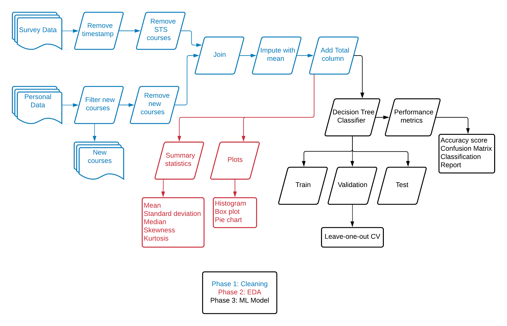

# VIT-Grade-Predictor
### Overview
VIT Grade Predictor is a machine learning application to predict the grade for a course based on the marks obtained in internal tests and lab assessments.

The grade predictor application is developed using data about various courses collected from students of VIT, Vellore through a survey. The data collected contains details about the marks obtained by students in the various components of a course, such as theory internals, lab assessments and project, and the corresponding grade obtained foir that course.

Using this data, a Decision Tree classifier model is trained to predict the grade for a new course based on the input for marks obtained in the various compoents mentioned.

### Pipeline

### Contribute
You can contriubute to this project by providing more data by filling out [this Google form](https://forms.gle/JEQbXUttVeLRrFss8)

---

Pratham Sharma

Student at Vellore Institute of Technology, Vellore, Tamil Nadu, India

Reach out to me: prathams2425@gmail.com

LinkedIn profile: https://www.linkedin.com/in/pratham-sharma-620418178/
